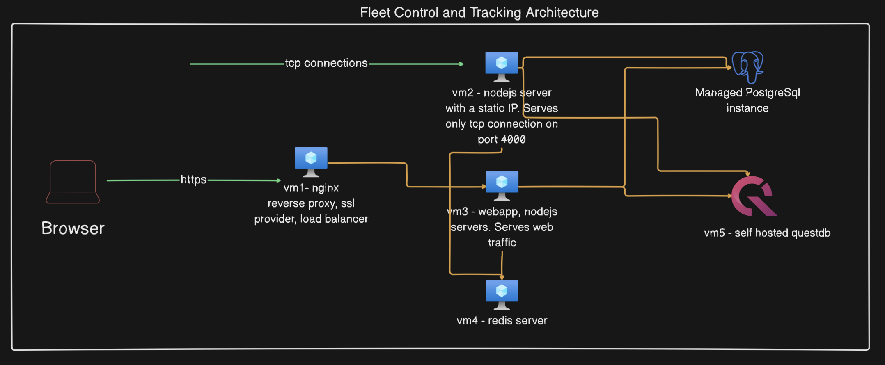
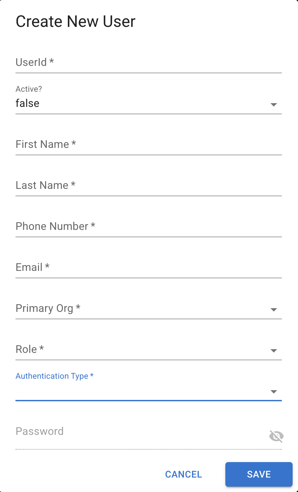
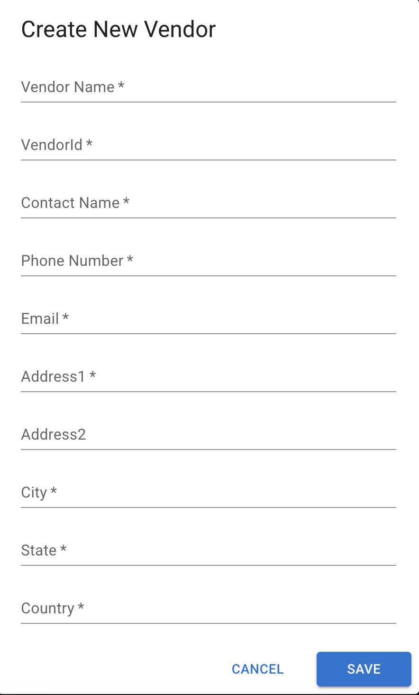
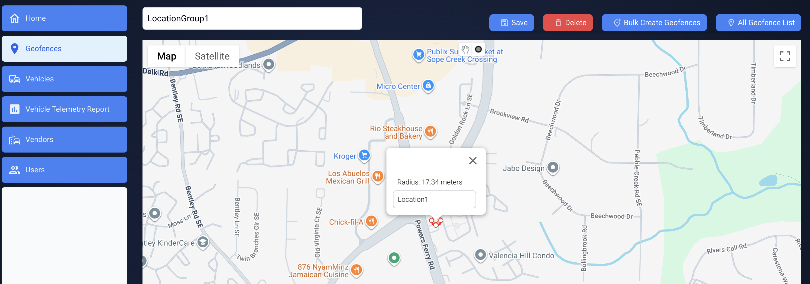
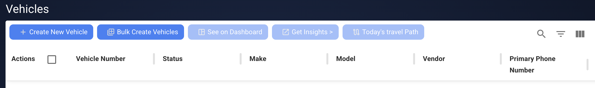
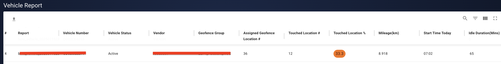
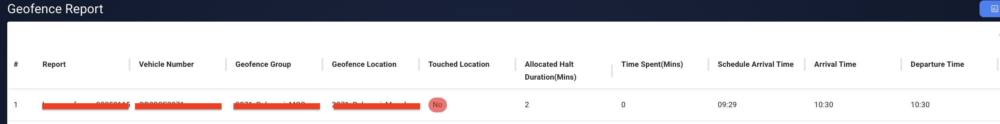

## Introduction
This is a simple, saas ready fleet control reporting and dashboard frontend component. This can be used along with the backend component [(github link)](https://github.com/oldcrux/fleetcontrol_server) for a full application experience.

This application can be connected to a fleet of vehicles telematics devices via tcp connection and pulls the vehicle data from the backend application every 10secs to show the live status on the google map.

## Architecture diagram
👉🏻 [Architecture diagram]



## Tech Stack
- Next.js
- TypeScript
- Material UI
- Tailwind CSS
- React
- Google Maps API
- DeckGL
- AuthJS

## Functional Features
1. Organization onboarding and management.
2. User onboarding. New user can be created by an administrator. Supported authentication methods - 
    1. Basic username and password.
    2. Google OAuth.


sample user Creation screenshot - 



3. Vendor onboarding. A vendor can be a contractor with a fleet of vehicles. A fleet can belong to a main organization or a vendor.

sample vendor creation screenshot - 



4. Create geofences and assign a group of geofences to a vehicle.  Alternatively, geofences can also be bulk created via a json file. More details like schedule arrival, halt duration at a location can be provided in the json file.

Note - only circle geofences are supported.

sample bulk create geofences payload - 
```
[
    {
        
        "geofenceType": "circle",
        "tag": "Location1",
        "radius": 30,
        "center": {"lat":20.311,"lng":85.8568},
        "geofenceLocationGroupName": "LocationGroup1",
        "scheduleArrival": "06:38:00",
        "haltDuration": 17,
        "orgId": "org1",
        "createdBy": "org1admin"
    },
    {
        
        "geofenceType": "circle",
        "tag": "Location2",
        "radius": 30,
        "center": {"lat":20.3096,"lng":85.8599},
        "geofenceLocationGroupName": "LocationGroup1",
        "scheduleArrival": "07:51:00",
        "haltDuration": 3,
        "orgId": "org1",
        "createdBy": "org1admin"
    },
    {
        
        "geofenceType": "circle",
        "tag": "Location3",
        "radius": 30,
        "center": {"lat":20.3082,"lng":85.8605},
        "geofenceLocationGroupName": "LocationGroup1",
        "scheduleArrival": "08:33:00",
        "haltDuration": 2,
        "orgId": "org1",
        "createdBy": "org1admin"
    }
]
```

sample geofence screenshot - 


5. Vehicle onboarding and tracking. A vehicle can either be created in the UI or bulk created via a json file.

sample vehicles screenshot - 



sample bulk create vehicles payload - 
```
[
  {
    "vehicleNumber": "ABCDE001",
    "make": "dummy",
    "model": "dummy",
    "owner": "Org1",
    "primaryPhoneNumber": "1234567890",
    "secondaryPhoneNumber": "",
    "serialNumber": "220717190",
    "vehicleGroup": "",
    "geofenceLocationGroupName": "",
    "orgId": "Org1",
    "createdBy": "org1admin"
  },
  {
    "vehicleNumber": "ABCDE002",
    "make": "dummy",
    "model": "dummy",
    "owner": "Org1",
    "primaryPhoneNumber": "1234567891",
    "secondaryPhoneNumber": "",
    "serialNumber": "220717191",
    "vehicleGroup": "",
    "geofenceLocationGroupName": "",
    "orgId": "Org1",
    "createdBy": "org1admin"
  }
]
```

6. Generate on-demand vehicle telemetry reports for the day with data like, total running time, total idle duration, geofences covered, time spent any assigned geofence location etc.

    Note - Vehicle reports are generated only if the vehicle is assigned with a geofence location group.

Sample vehicle report screenshot - 


Sample geofence report screenshot - 



7. Geofence accuracy - This is a configurable number by which geohashing precision is calculated and determined whether a vehicle has traveled to an assigned geofence location. This can be configured at each Org level and defaulted to 30 meters.
8. Vehicle arrival window - A configurable time window, lets say 15mins to determine whether a vehicle has arrived an assigned location on time or not.
7. Email reports in xls format.


### Authentication
The application has a basic auth setup and the APIs are protected behind a middleware, which validates the auth token, before letting API access.

#### Google OAuth Setup Guide

To enable Google OAuth in your application, follow the steps below:

- 📄 [Google OAuth Documentation](https://developers.google.com/identity/protocols/oauth2)  
  Review the official Google documentation for understanding OAuth 2.0 implementation.

- ⚙️ [Google OAuth Configuration](https://console.developers.google.com/apis/credentials)  
  Visit the Google Developer Console to create and manage your OAuth client credentials.

This setup should be done on the frontend application, and the same ```GOOGLE_CLIENT_ID, GOOGLE_CLIENT_SECRET``` must be maintained here.

### Prerequisite
1. Docker demon
2. Node
3. npm
4. Google Map API key. You need a google map api key to use google maps. Follow the documentation given [here](https://developers.google.com/maps/documentation/javascript/get-api-key)


### .env file template
```
NEXT_PUBLIC_GOOGLE_MAP_API_KEY=
NEXT_PUBLIC_NODE_SERVER_URL=http://localhost:8080

# This is sample AUTH_SECRET value. Make sure to change it for your application. This key must be same across your frontend and backend server app. Here is an app where you can generate a random secret - https://auth-secret-gen.vercel.app/
AUTH_SECRET=bb9u0srGafGVy5smDOkRZTtD0i74XOS5q45rTkinsRc=

AUTH_MAX_AGE=14400    #, // 4 hours
AUTH_UPDATE_AGE=36000     #10 * 60 * 60 // 10 hours

# GOOGLE_CLIENT_ID and GOOGLE_CLIENT_SECRET are required for google oauth setup. Follow the documentation given above
GOOGLE_CLIENT_ID=
GOOGLE_CLIENT_SECRET=

```

### Application setup and Running
Before you begin using this frontend application, you need to have a backend application running. Follow the instructions in the [(github link)](https://github.com/oldcrux/nodeserver). Then execute below command to start the application in local - 

```
npm install
npm run dev
```

### Docker build and push
```
docker build --no-cache --platform linux/amd64 -t <your repo> .
docker push <your repo>
```

## License

This project is licensed under the Apache License 2.0 - see the LICENSE file for details.
